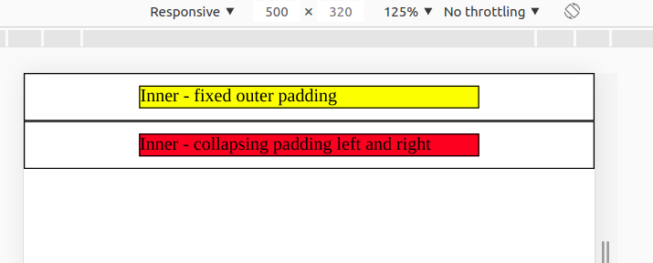
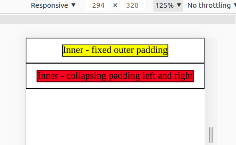

# Exercise 3 - Padding vs Width

Within index.html file we find two parent divs. Each having one child div.

We now want to dimension the space between the parent and the child.

Instructions:

- Child 1 (inner1) should get centered by using 20% padding left and right
- Child 2 (inner2) should be centered without padding, by a parent flexbox. Depending on its content the width should vary between 60% and 90% of the parent

See the following images for reference:

Initial state => children both take 60% width:

Shrinking the viewport => second child takes up to 90% of the width!

Create the needed HTML and CSS in one file (index.html + embedded CSS).

